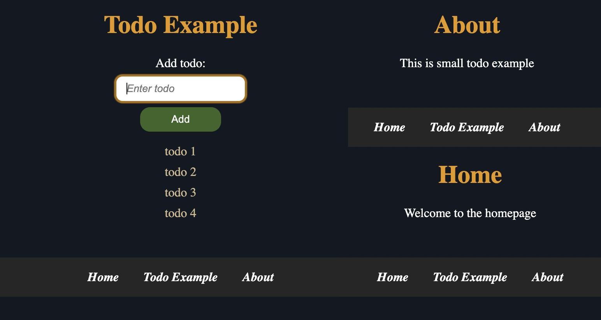

# Testing deployed repository with server side rendering

The purpose of deployed repository is to show how repository can be deployed (put online to world wide web) using some of the free hosting clouds. The following example is simple todo application which is fully integrated with backend and database with focus on deploying. It can be extended to more complex CRUD application or used as barebone, but the point is not in app complexity, rather deploying an app.

## Free hosting cloud services

There are many free hosting cloud services such as [Render](https://render.com/), [Railway](https://railway.app/), [Netlify](https://www.netlify.com/), [Vercel](https://vercel.com/), etc. For hosting a free database for this example, use [MongoDB Atlas](https://www.mongodb.com/).

## Example

The following example are using vanilla javascript and nodejs ejs templates for rendering frontend pages, plain CSS for styling, typescript with nodejs for backend api and mongoDB for database. For hosting cloud services are using [Render](https://render.com/) for frontend and backend code and [MongoDB Atlas](https://www.mongodb.com/) for database. It is server side rendering (SSR) application.

## How to run example

There are two ways to run example: locally or online. Local running is used for testing purposes on local machine before putting application online to the web. Online running is used for deploying an app alive to the web.

### MongoDB Atlas configurations

Create cluster on MongoDB Atlas cloud. Copy connection string for cloud database for the application under _Deployment_ from the _Database_ -> _Connect_ -> _Connect your application_. Choose driver for desired language and version and copy connection string. Under _Security_ choose _Database Access_ -> _Add new database user_ and create new user for the database with username and password. Go to _Network Access_ -> _IP Access List_ and choose from which IP address(es) cluster databases can be accessed. Without set network access, database queries will not work.

Connection string for database is important because it will be used for [.env configuration files](#env-configuration-files).

### Available scripts

There are many scripts written in _package.json_ file for running and debugging app.

1. _typescript-build_

    Used for compiling backend code from _backend/ts/_ typescript files to _backend/js/_ javascript files.

2. _typescript-watch_

    The same as previous _*typescript-build*_ except it watches for changes and compiles after each change of typescript files. It's mainly used for backend code debugging.

3. _start-development-windows_

    Start application in development mode using local mongoDB (_mongodb://localhost:27017/_) for Windows machine.

4. _start-production-windows_

    Start application in production mode using mongoDB cloud services (_mongodb+srv://{db_user}:{db_pass}@{cluster}.mongodb.net/test_) for Windows machine.

5. _start-development-unix_

    The same as _start-development-windows_ script, but for Unix like systems (Linux, Mac).

6. _start-production-unix_

    The same as _start-production-windows_ script, but for Unix like systems (Linux, Mac).

### .env configuration files

Copy _.env.format_ file to two files: _.env.development_ (development configuration) and _.env.production_ (production configuration) .

For development configuration use environment variables NODE_ENV=development, PORT=4000, SERVER_ADDRESS=localhost, DATABASE_URL=mongodb://localhost:27017/ . For development mode local mongoDB database is used on local machine and localhost address for server application.

For production configuration use environment variables NODE_ENV=production, PORT=4000, SERVER_ADDRESS=localhost, DATABASE_URL=mongodb+srv://{db_user}:{db_pass}@{cluster}.mongodb.net/test . For production mode MongoDB Atlas cloud database is used and localhost address for server application. Please note that localhost address is still used like development mode because port forwarding with address NAT is implicitly used for cloud services such as [Render](https://render.com/). That means public address from Render cloud will be translated to the localhost address to the hosted server app.

### Local app running

To run app on Unix like systems (Linux, Mac), type command:

```shell
npm run start-development-unix
```

It will run app in development mode for debugging purposes.

There is another command for running local app in production mode with hosted mongoDB database:

```shell
npm run start-production-unix
```

To run app on windows system use windows npm scripts alternatives in [available scripts](#available-scripts).

Open http://localhost:4000/ in browser to use app (see [.env.development](#env-configuration-files) for details).

### Online (deployed) app running

For deployement of app, [Render](https://render.com/) will be used as an example. Login with Github account and dashboard will be opened. Create new web service by _New_ -> _Web service_ and connect to repository which is needed for deployment. Under _Name_ put some name of web service. Under _Region_ choose server which is closest to locations of app users because it will be place where deployed app will be running. Under _Branch_ choose Github branch for app. Under _Build Command_ set _npm install_ for installing all libraries and dependencies when any change is made on Github repository. Under _Start Command_ set command for starting web server for the app. It will be _npm run start-production-windows_ npm script for Windows machine (look for [4. start-production-windows](#available-scripts)). Finally click on _Create Web Service_ to finish.

When any changes happens on Github repository with new commits, deployment of app will be automatically and server will be restarted and relaunched again. It can take some time.

Now go to _Dashboard_ and click on created web service. Go to _Environment_ and under _Environment Variables_ set all environment variables from [.env.production](#env-configuration-files) file. Those variables will be used as placeholders for all environment variables in the application (_process.env.VARIABLE_NAME_ for nodejs).

If app is not deployed properly, then go to _Logs_ and console prints will be available for debugging. Otherwise, if app is deployed successfully, then under web service name, click on the link that looks like [https://deploy-service-<CUSTOM_ID>.onrender.com](https://deploy-service-<CUSTOM_ID>.onrender.com) and deployed app will be opened in new browser tab.


